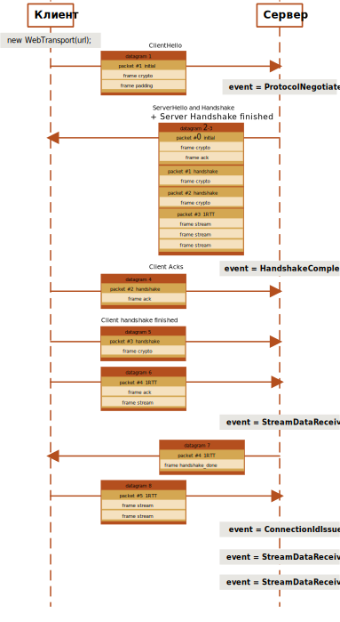
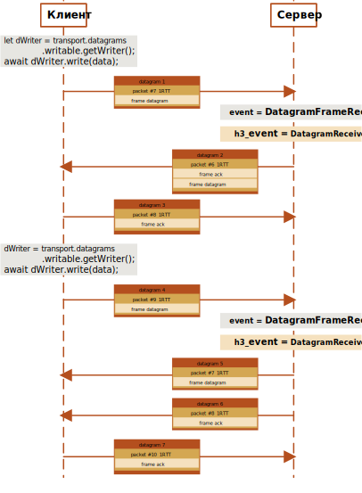
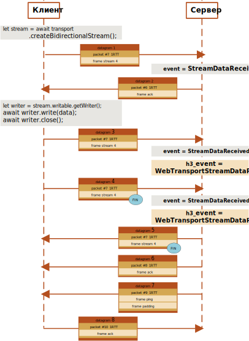

Статья является заметкой про библиотеку aioquic и ее использование для WebTransport. Заметка была ранее написана как разбор чужого примера, при знакомстве с aioquic. Заметка описывает события QUIC и HTTP/3 реализованные в aioquic, опираясь на старый рабочий демонстрационнай пример. В худших академических традициях, к старой заметке была добавлена "вода" про кликер - о создании простейшего приложения которое увеличивает число по запросу пользователя. 
Для тех, кому не не интересна "вода", лучше начать с раздела [Работа с WebTransport в Python используя aioquic]. 


# Введение

В сети, при изучении нового фреймворка (будь то фреймворк для создания нового графического интерфейса или web-среймворк), очень часто можно встретить пример реализации приложения "кликер". Суть таких приложений проста - читающему руководство предлагается создать форму с одной кнопкой, при нажатии на которую происходит увеличение некого числа на единицу. Думаю, что многие видели такие примеры. Ничего необычного. Я бы даже мог назвать такие примеры довольно скучными, если бы ни недавний пример с Хомяком (Hamster Combat). Получается, что даже у таких простых примеров есть воплощения, которые могут занять многих.

Возможно, нашлось не мало людей, увидев такой успех как у Хомяка, побежали пробовать реализовать что-то похожее. Конечно, более предприимчивые побежали реализовывать программы, которые имитирую клики (т.е. пошли делать лопаты). Но далее повествование будет относительно первой группы людей, и представителем данной группы будет John Doe, который решил повторить "успешный успех". 

(на самом деле история про кликер надуманная и была придумана как "вода" к заметке, которая была записана ранее, при знакомстве с библиотекой aioquic).


## Причем тут WebTransport и HTTP/3?

Очевидно, что для того, чтобы пользователь мог быстро кликать по кнопке, а его счет увеличивался пропорционально количеству нажатий на кнопку, а также, чтобы не было лишних зависаний (ожиданий), нужно задуматься о том, как будет проходить взаимодействие между клиентом и сервером.   

	Сразу уточним, что пока мы возьмем наивное решение, где действие в интерфейсе пользователя — это один запрос на сервер на увеличение значения состояния на единицу.

Первое, о чем задумался наш John Doe, для реализации отзывчивого кликера, доступного тысячам человек одновременно — это выбор технологии которая должна обеспечить взаимодействие клиентской и серверной частей кликера:

- **REST API на базе HTTP/1.1** - "Кажется, что все просто" - подумал John Doe. Один ендпоинт для PUT запроса, обработчик которого увеличивает значение состояния на единицу. И еще один ендпоинт для GET запроса, в ответ на который возвращается текущее значение. Однако, те, кто не сразу бросился писать код, могут подумать (или нагуглить в интернете) о том, что при таком подходе будет излишнее количество рукопожатий, при установлении TLS соединения, и ненужные блокировки соединения ([Head-of-Line Blocking](https://en.wikipedia.org/wiki/Head-of-line_blocking)). Это не очень-то хорошо подходит к требованиям к кликеру \[утверждение надуманное и специально преувеличенно\].
- **WebSocket** - "Вот это подходящий инструмент" - подумал наш John Doe, который уже успел реализовать сервис с REST API используя крутой фреймворк [FastAPI](https://fastapi.tiangolo.com/) - "и сильно переписывать ничего не нужно, ведь FastApi содержит реализацию для работы с WebSocket". WebSocket - это хорошая технология, проверенная временем, но наш John Doe успел почитать интернет и столкнулся с комментариями типа "... на дворе 2024 год, зачем использовать технологии из 2011 года?". "И что тогда использовать?" - задался вопросом наш John Doe. Есть еще Long Polling, Server Sent Events, а также WebTransport. 
- **WebTransport** - это новая технология, основанная на новом протоколе HTTP/3. WebSockets основан на TCP, поэтому имеет ограничения TCP, которые делают его менее подходящим для приложений, чувствительных к задержкам (блокировка начала очереди, отсутствие поддержки ненадежной передачи данных). WebTransport предоставляет клиент-серверный API, который поддерживает двунаправленную передачу как ненадежных, так и надежных данных, используя UDP-подобные дейтаграммы и отменяемые потоки [ref](https://chromestatus.com/feature/4854144902889472). "Нужно брать" - воскликнул John Doe и пошел читать, смотреть. 


Второе, о чем задумался John Doe - Архитектура. Это тема для отдельной заметки, где могут быть изложены разные примеры архитектур систем и принципов(паттернов) проектирования. Например, там может быть описан принцип CQRS, когда команды на чтения и на запись разделены. Может быть написано о паттерне Pub/Sub. Или может быть рассказано о брокерах сообщений, а может про взаимодействие нескольких процессов через socket.  И еще большим разнообразием как может быть решена одна и также простая задача. Хотя для такой простой задачи (кликер) многие архитектурные решения могут быть ни к чему. 

# Работа с WebTransport в Python используя aioquic

	Обязательно стоит упомянуть, что [WebTransport](https://datatracker.ietf.org/doc/html/draft-ietf-webtrans-http3) еще находится в черновом варианте. 

WebTransport - это фреймворк [ref](https://datatracker.ietf.org/doc/html/draft-ietf-webtrans-overview-07) для организации отправки дейтаграмм, однонаправленных и двунаправленных потоков используя протокол HTTP/3. Несмотря на то, что WebTransport строится поверх HTTP/3, передача данных ведется почти напрямую через потоки QUIC, а HTTP используется для "своего рукопожатия". 

При первом знакомстве с HTTP/3 и QUIC я очень рекомендую цикл статей:
- [**Part 1: HTTP/3 History And Core Concepts**](https://www.smashingmagazine.com/2021/08/http3-core-concepts-part1/)
- [**Part 2: HTTP/3 Performance Features**](https://www.smashingmagazine.com/2021/08/http3-performance-improvements-part2/)
- [**Part 3: Practical HTTP/3 Deployment Options**](https://www.smashingmagazine.com/2021/09/http3-practical-deployment-options-part3/)

Для работы с QUIC и HTTP/3 на python можно использовать библиотеку [aioquic](https://aioquic.readthedocs.io/en/latest/). Библиотека для работы позволяет писать конкурентный код с использованием async/await синтаксиса и строится с использованием asyncio. Библиотека не является полноценным фреймворком для построения веб приложений (как например FastApi), а является рабочим инструментом, при помощи которого могут быть написаны веб-сервера, клиентские приложения.

Начать знакомство с библиотекой можно с [документации](https://aioquic.readthedocs.io/en/latest/), которая предоставляет минимальное описание классов и методов, реализованных в коде.

В качестве второй отправной точки можно предложить знакомство с примером кода из GoooleChrome GitHub [GoogleChrome/samples/webtransport](https://github.com/GoogleChrome/samples/tree/gh-pages/webtransport) 

В примере от GoooleChrome предоставлена реализация сервера на Python и клиента с использованием JavaScript. Данный пример - это почти готовый пример решающий почти нашу задачу с кликером. Осталось в нем разобраться, а после подправить эти странные "почти".

## Знакомство с примером от GoooleChrome

Код примера от GoooleChrome

```python
# ref: https://github.com/GoogleChrome/samples/tree/gh-pages/webtransport

import argparse
import asyncio
import logging
from collections import defaultdict
from typing import Dict, Optional

from aioquic.asyncio import QuicConnectionProtocol, serve
from aioquic.h3.connection import H3_ALPN, H3Connection
from aioquic.h3.events import H3Event, HeadersReceived, WebTransportStreamDataReceived, DatagramReceived
from aioquic.quic.configuration import QuicConfiguration
from aioquic.quic.connection import stream_is_unidirectional
from aioquic.quic.events import ProtocolNegotiated, StreamReset, QuicEvent

BIND_ADDRESS = '::1'
BIND_PORT = 4433

logger = logging.getLogger(__name__)

class CounterHandler:

    def __init__(self, session_id, http: H3Connection) -> None:
        self._session_id = session_id
        self._http = http
        self._counters = defaultdict(int)

    def h3_event_received(self, event: H3Event) -> None:
        if isinstance(event, DatagramReceived):
            payload = str(len(event.data)).encode('ascii')
            self._http.send_datagram(self._session_id, payload)

        if isinstance(event, WebTransportStreamDataReceived):
            self._counters[event.stream_id] += len(event.data)
            if event.stream_ended:
                if stream_is_unidirectional(event.stream_id):
                    response_id = self._http.create_webtransport_stream(
                        self._session_id, is_unidirectional=True)
                else:
                    response_id = event.stream_id
                payload = str(self._counters[event.stream_id]).encode('ascii')
                self._http._quic.send_stream_data(
                    response_id, payload, end_stream=True)
                self.stream_closed(event.stream_id)

    def stream_closed(self, stream_id: int) -> None:
        try:
            del self._counters[stream_id]
        except KeyError:
            pass


class WebTransportProtocol(QuicConnectionProtocol):

    def __init__(self, *args, **kwargs) -> None:
        super().__init__(*args, **kwargs)
        self._http: Optional[H3Connection] = None
        self._handler: Optional[CounterHandler] = None

    def quic_event_received(self, event: QuicEvent) -> None:
        if isinstance(event, ProtocolNegotiated):
            self._http = H3Connection(self._quic, enable_webtransport=True)
        elif isinstance(event, StreamReset) and self._handler is not None:
            self._handler.stream_closed(event.stream_id)

        if self._http is not None:
            for h3_event in self._http.handle_event(event):
                self._h3_event_received(h3_event)

    def _h3_event_received(self, event: H3Event) -> None:
        if isinstance(event, HeadersReceived):
            headers = {}
            for header, value in event.headers:
                headers[header] = value
            if (headers.get(b":method") == b"CONNECT" and
                    headers.get(b":protocol") == b"webtransport"):
                self._handshake_webtransport(event.stream_id, headers)
            else:
                self._send_response(event.stream_id, 400, end_stream=True)

        if self._handler:
            self._handler.h3_event_received(event)

    def _handshake_webtransport(self,
                                stream_id: int,
                                request_headers: Dict[bytes, bytes]) -> None:
        authority = request_headers.get(b":authority")
        path = request_headers.get(b":path")
        if authority is None or path is None:
            self._send_response(stream_id, 400, end_stream=True)
            return
        if path == b"/counter":
            assert(self._handler is None)
            self._handler = CounterHandler(stream_id, self._http)
            self._send_response(stream_id, 200)
        else:
            self._send_response(stream_id, 404, end_stream=True)

    def _send_response(self,
                       stream_id: int,
                       status_code: int,
                       end_stream=False) -> None:
        headers = [(b":status", str(status_code).encode())]
        if status_code == 200:
            headers.append((b"sec-webtransport-http3-draft", b"draft02"))
        self._http.send_headers(
            stream_id=stream_id, headers=headers, end_stream=end_stream)


if __name__ == '__main__':
    parser = argparse.ArgumentParser()
    parser.add_argument('certificate')
    parser.add_argument('key')
    args = parser.parse_args()

    configuration = QuicConfiguration(
        alpn_protocols=H3_ALPN,
        is_client=False,
        max_datagram_frame_size=65536,
    )
    configuration.load_cert_chain(args.certificate, args.key)

    loop = asyncio.get_event_loop()
    loop.run_until_complete(
        serve(
            BIND_ADDRESS,
            BIND_PORT,
            configuration=configuration,
            create_protocol=WebTransportProtocol,
        ))
    try:
        logging.info(
            "Listening on https://{}:{}".format(BIND_ADDRESS, BIND_PORT))
        loop.run_forever()
    except KeyboardInterrupt:
        pass
```


Для запуска сервера используется вызов метода `aioquic.asyncio.server()`:

```python
# ...
from aioquic.asyncio import QuicConnectionProtocol, serve
# ...
if __name__ == '__main__':
	# ...
	configuration = QuicConfiguration(
        alpn_protocols=H3_ALPN,
        is_client=False,
        max_datagram_frame_size=65536,
    )
    # ...
	loop = asyncio.get_event_loop()
    loop.run_until_complete(
        serve(
            BIND_ADDRESS,
            BIND_PORT,
            configuration=configuration,
            create_protocol=WebTransportProtocol,
        ))
	# ...
# ...
```

Вызов **aioquic.asyncio.server** возвращает экземпляр `aioquic.asyncio.server.QuicServer` запущенный на указанном адресе и порту. На практике может быть куда удобнее описать свой класс сервера унаследовав его от `aioquic.asyncio.server.QuicServer`.
При вызове функции `aioquic.asyncio.server()`, потребуется указать `aioquic.quic.configuration.QuicConfiguration` с параметрами сертификата TLS и закрытого ключа и класс с реализацией `~asyncio.DatagramProtocol` для управления обмена данными (соединением). 

Полезно: *при инициализации `aioquic.quic.configuration.QuicConfiguration` есть возможность передать свою реализацию логгера унаследованную от `aioquic.quic.logger.QuicLogger`, что позволит удобно отслеживать работу библиотеки (при разработке).*

В примере от GoooleChrome описан следующий класс **WebTransportProtocol** для управления соединением:
```python
# ...
from aioquic.asyncio import QuicConnectionProtocol, serve
from aioquic.h3.connection import H3_ALPN, H3Connection
# ...
class WebTransportProtocol(QuicConnectionProtocol):

    def __init__(self, *args, **kwargs) -> None:
        super().__init__(*args, **kwargs)
        self._http: Optional[H3Connection] = None
        self._handler: Optional[CounterHandler] = None
	# ...
# ...

```

Если ранее вы уже использовали `~asyncio.DatagramProtocol` или `~asyncio.Protocol`, то вам знакома работа по переопределению таких методов как:
- connection_made(transport): Этот метод вызывается, когда соединение с сервером установлено. transport - это объект, который позволяет вам отправлять данные/дейтаграммы на сервер.
- data_received(data) или datagram_received(data, addr): Этот метод вызывается, когда данные/дейтаграммы получены от сервера. data - это объект, содержащий полученные данные, а addr - это адрес устройства, от которого получена дейтаграмма.
- connection_lost(exc): Этот метод вызывается, когда соединение с сервером закрыто. exc - это исключение, которое произошло при закрытии соединения.
Описанный класс `WebTransportProtocol` наследуется от `aioquic.asyncio.QuicConnectionProtocol` который в свою очередь наследуется от `asyncio.DatagramProtocol`.

Библиотека aioquic предоставляет интересную абстракцию в виде событий QUIC и HTTP/3. Реализация класса `WebTransportProtocol` позволяет нам получить доступ к этим событиям.
## Обработка событий QUIC в aioquic

При работе с `aioquic.asyncio.QuicConnectionProtocol` нам доступен метод `quic_event_received()`, который вызывается каждый раз при получении события QUIC. В официальном примере повторно реализован данный метод в подклассе WebTransportProtocol:

```python
# ...
from aioquic.h3.connection import H3_ALPN, H3Connection
from aioquic.quic.events import ProtocolNegotiated, StreamReset, QuicEvent
# ...
class WebTransportProtocol(QuicConnectionProtocol):
	# ...
	def quic_event_received(self, event: QuicEvent) -> None:
	        if isinstance(event, ProtocolNegotiated):
	            self._http = H3Connection(self._quic, enable_webtransport=True)
	        elif isinstance(event, StreamReset) and self._handler is not None:
	            self._handler.stream_closed(event.stream_id)
	
	        if self._http is not None:
	            for h3_event in self._http.handle_event(event):
	                self._h3_event_received(h3_event)
```

Метод `quic_event_received()` при вызове получает все события `aioquic.quic.events.QuicEvent` и реализует логику по их обработке. В текущем пример происходит обработка события `aioquic.quic.events.ProtocolNegotiated`, которое наступает после согласования ALPN (Application-Layer Protocol Negotiation). В коде(примере) создается экземпляр `aioquic.h3.connection.H3Connection`, при наступлении события:

```python
# ...
if isinstance(event, ProtocolNegotiated):
	self._http = H3Connection(self._quic, enable_webtransport=True)
# ...
```

Событие `aioquic.quic.events.ProtocolNegotiated` будет самым первым событием (из событий QUIC представленных в `aioquic.quic.events`), которое вы зарегистрируете при подключении к вашему серверу.

Также пример содержит обработку события `aioquic.quic.events.StreamReset`, при наступлении которого мы закрываем поток:
```python
# ...
elif isinstance(event, StreamReset) and self._handler is not None:
	self._handler.stream_closed(event.stream_id)
# ...
```

В конце метода `quic_event_received()` выполняется парсинг события QUIC и возвращается список событий HTTP/3 (о них мы поговорим чуть позднее) который передается обработчику `self._h3_event_received()`:
```python
# ...
if isinstance(event, ProtocolNegotiated):
	self._http = H3Connection(self._quic, enable_webtransport=True)
# ...
```

### События QUIC из `aioquic.quic.events`

Библиотека aioquic предоставляет следующий список классов событий QUIC:
- **ConnectionIdIssued** - наступает при получении идентификатора соединения (установлении нового соединения или обновлении текущего) и содержит тот самый идентификатор. По сути, идентификатор соединения - это некий положительный порядковый номер. Стоит отметить, что в реальности может быть пул доступных идентификаторов соединения. При работе с соединением мы можем отозвать идентификатор соединения и сгенерировать новый.
- **ConnectionIdRetired** - наступает при вызове метода `_retire_peer_cid()` и указывает на то, что идентификатор соединения был отозван или обновлен. Событие содержит новый идентификатор. Оба события ConnectionIdIssued и ConnectionIdRetired помогают отслеживать состояние соединений и \[например\] закрывать не нужные(устаревшие) соединения.
- **ConnectionTerminated** - наступает при разрыве соединения QUIC. Разрыв соединения может наступить по разным причинам: превышен таймаут простоя, или если была отправлена дейтаграмма CONNECTION_CLOSE. Событие содержит код ошибки и ее описание.
- **DatagramFrameReceived** - наступает при получении дейтаграммы и содержит данные. DatagramFrame - это единица данных в протоколе QUIC, которая используется для передачи данных между участниками соединения.
- **HandshakeCompleted** - наступает после завершения установления TLS соединения. Событие сообщает нам, что далее мы можем обеспечить безопасность передачи данных. Событие может содержать информацию о выбранном, в ходе ALPN, протоколе, информацию о том, были ли переданы данные до завершения процесса рукопожатия (использование 0-RTT может быть крайне эффективной оптимизацией ускорения передачи данных, однако требует быть более внимательным в вопросе безопасности).
- **PingAcknowledged** - наступает при получении ответа на ping сообщение. Т.е. когда участник соединение отправляет пинг, он ожидает получить ответ от другого участника. Если ответ получен, то QUIC-соединение считает, что сеть доступна и работает корректно. Событие содержит уникальный идентификатор PING. Самостоятельно ping сообщение можно послать используя метод `send_ping()` у экземпляра класса `QuicConnection`.
- **ProtocolNegotiated** - наступает после завершения согласования ALPN и содержит указание согласованного протокола.
- **StopSendingReceived** - наступает, когда удаленный узел запрашивает остановку передачи данных в потоке. Содержит код ошибки и идентификатор потока, для которого была запрошена остановка (не путать с идентификатором соединения).
- **StreamDataReceived** - наступает, когда были получены данные в потоке. Событие содержит данные, переданные в потоке, идентификатор потока, от которого были получены данные и флаг о наличии FIN (означает, что требуется закрыть поток).
- **StreamReset** - наступает, когда удаленный узел сбрасывает поток. Содержит идентификатор потока и код ошибки.


## Обработка событий HTTP/3 в aioquic

Также как для событий QUIC, aioquic содержит реализацию датаклассов для событий HTTP/3. Эти события строятся поверх событий QUIC. Для обработки событий QUIC и извлечения из них данных относящихся к событиям HTTP/3 в `aioquic.h3.connection.H3Connection` реализован метод `handle_event()`. В качестве входного параметра метод ожидает одно из двух событий QUIC: `aioquic.quic.events.StreamDataReceived` и `aioquic.quic.events.DatagramFrameReceived`.


Для работы с HTTP/3, ранее, мы создали экземпляр `aioquic.h3.connection.H3Connection`:
```python
# ...
class WebTransportProtocol(QuicConnectionProtocol):
	# ...
	def quic_event_received(self, event: QuicEvent) -> None:
	        if isinstance(event, ProtocolNegotiated):
				self._http = H3Connection(self._quic, enable_webtransport=True)
# ...
```
Теперь мы можем выполнить парсинг данных переданных в дейтаграммах и получить список HTTP/3 событий, вызвав метод `handle_event()` у экземпляра `aioquic.h3.connection.H3Connection`;
```python
# ...
class WebTransportProtocol(QuicConnectionProtocol):
	# ...
	def quic_event_received(self, event: QuicEvent) -> None:
		# ...
		if self._http is not None:
			for h3_event in self._http.handle_event(event):
				self._h3_event_received(h3_event)
# ...
```

### События HTTP/3 из `aioquic.h3.events`

- **HeadersReceived** - наступает после получения сервером заголовков в запросе клиента. Они представлены в виде пар ключ:значение. Обычная обработка заключается в определении метода и адреса запроса, проверки разрешений (авторизации). Событие содержит: список заголовков, идентификатор потока и флаг о наличии в потоке FIN, для закрытия потока. В рассматриваемом примере от GoogleChrome можно увидеть пример такой обработки реализованным в методе `_h3_event_received()` класса WebTransportProtocol. Если помните, ранее, когда рассматривали события QUIC мы закомментировали строку создания экземпляра `aioquic.h3.connection.H3Connection`, из-за чего по истечении таймаута наше соединение было разорвано. Все дело в том, что клиент направил нам запрос с заголовками на который сервер не ответил в отведенное время. Обязательно обратите внимание на метод `_handshake_webtransport()` и вызываемый его метод `_h3_event_received()`. Примечание: Да, все так - заголовки могут быть переданы отдельно от данных. Для них предусмотрен специальный формат фрейма, чтобы уместить их в как можно меньшее количество пакетов.
- **DataReceived** - наступает когда в потоке поступают данные.
- **DatagramReceived** - наступает когда от клиента поступает дейтаграмма. Содержит данные и номер потока из которого получена дейтаграмма.
- **WebTransportStreamDataReceived** - наступает когда в отдельном WebTransport потоке были направлены данные от клиента.

Более детальную информацию о QUIC можно получить из очень классной (на мой взгляд) статьи [HTTP/3 in Practice — QUIC](https://www.andy-pearce.com/blog/posts/2023/Mar/http3-in-practice-quic/ "Permalink to HTTP/3 in Practice — QUIC")


## Обработка событий в aioquic на практике

### Установка соединения

После знакомства со списком событий QUIC из библиотеки aioquic, стоит посмотреть, что же происходит на практике, при подключении к серверу (что обрабатывает функция `quic_event_received()`).

Подключаться к серверу будем через браузер (как в примере). Для этого следует воспользоваться вызовом следующей функции написанной на javascript:
```javascript
async function initTransport(url) {
  const transport = new WebTransport(url);
  await transport.ready;
  return transport;
}
```

При создании нового экземпляра WebTransport, в качестве параметров был использован лишь адрес, поэтому будет создано выделенное соединение без поддержки надежных транспортов и с обычной аутентификацией Web PKI с сервером. 

Перед тем, как начать знакомиться с событиями, которые обработает функция `quic_event_received()` при установлении соединения, временно внесем в нее небольшие изменения. Закомментируем строчку кода, отвечающую за создание соединения H3Connection с поддержкой WebTransport:

```python
# ...
# ...
class WebTransportProtocol(QuicConnectionProtocol):
	# ...
	def quic_event_received(self, event: QuicEvent) -> None:
	        if isinstance(event, ProtocolNegotiated):
		        # временно не будем создавать соединение H3
	            # self._http = H3Connection(self._quic, enable_webtransport=True)
	        # ...
# ...
```

В этом случаи, при установлении соединения, переопределенная нами функция `quic_event_received()` обработает следующую последовательность событий:
1. ProtocolNegotiated - как и было упомянуто ранее, первым делом будет получено именно это событие. В нашем примере будет получен ProtocolNegotiated(alpn_protocol='h3')
2. HandshakeCompleted - завершение установления TLS соединения.
3. StreamDataReceived - получение данных, подтверждающих соединение от клиента.
4. ConnectionIdIssued - Получим идентификатор соединения.

Так как ранее мы не стали устанавливать HTTP/3 соединение (закомментировали строчку с инициализацией экземпляра `aioquic.h3.connection.H3Connection`), то по прошествии таймаута функция  `quic_event_received()` получит событие `aioquic.quic.events.ConnectionTerminated` из-за простоя.

Если мы обратно вернем строчку `self._http = H3Connection(self._quic, enable_webtransport=True)`, то наш сервер зарегистрирует еще два события `aioquic.quic.events.StreamDataReceived`.

Ниже будет приведен примерный (только для наглядности) порядок обработки событий при установлении соединения (рукопожатия):




Datagram 1
	 Клиентское приложение направляет на сервер дейтаграмму (datagram 1) c инициирующим пакетом (packet #1 Initial), который содержит сообщение TLS "ClientHello". В данном пакете передаются: набор шифров, которые поддерживает клиент; открытый ключ; версии протоколов, которые поддерживает клиент; случайные данные. Дополнительно был направлен еще один пакет, чтобы дополнить дейтаграмму (datagram 1) до длины 1200 байт.
event = ProtocolNegotiated
	Функция `quic_event_received()` обработает событие ProtocolNegotiated после получения дейтаграммы (datagram 1) от клиента.
Datagram 2
	В ответ (datagram 2) сервер направляет сообщение TLS "ServerHello", содержащее в инициирующим пакете (packet #0 Initial). В данном пакете передаются: случайные данные с сервера; итоговый набор шифров; открытый ключ; согласованная версия протокола. 
	В этой же дейтаграмме будет передан пакет с "рукопожатием" (packet #1 handshake), который содержит один или несколько сертификатов и перечень всех зашифрованных расширений.
Datagram 3
	В текущей дейтаграмме продолжается отправка пакетов с "рукопожатием" (packet #2 handshake), который содержит информацию, связывающую эфемерный ключ с закрытым ключом. Ко всему прочему в данном пакете содержится информация о подтверждении, что "рукопожатие" прошло успешно (хеш всех сообщений рукопожатия).
event = HandshakeCompleted
	Функция `quic_event_received()` обработает событие HandshakeCompleted после отправки дейтаграммы (datagram 3) клиенту.
Datagram 4
	Клиент выполнит отправку пакета с подтверждением инициирующего пакета от сервера (Datagram 1 packet #1 Initial)
Datagram 5
	Будет выполнена отправка пакета с "рукопожатием", содержащим TLS запись указывающей на завершение процесса установления связи. 
Datagram 6
	Какие-то данные от клиента. Выступают в роли PING сообщения (либо я не понял зачем). 
event = StreamDataReceived
	Функция `quic_event_received()` обработает событие StreamDataReceived содержащее данные полученные от клиента в дейтаграмме (datagram 6). 
Datagram 7
	Сервер направит пакет со своим подтверждением о завершении процесса "рукопожатия", а также PONG сообщение.
event = StreamDataReceived
	С этого события можно считать, что установлено соединение. Функция `quic_event_received()` обработает событие StreamDataReceived в котором будет указан идентификатор соединения.
Datagram 8
	Клиент подтвердит получение данных от сервера, а также в потоке отправит данные относящиеся к HTTP/3.

Всегда есть возможность перехватывать более низкоуровневые события (пример, получения фрейма), но aioquic предоставляет более абстрактные события, которые могут быть использованы для большинства сценариев.


При работе с WebTransport доступны три сценария: отправка дейтаграммы, отправка в однонаправленный поток и отправка в двунаправленный поток. 

### Отправка дейтаграммы

Для отправки дейтаграммы необходимо выполнить следующий код на javascript:
```javascript
async function sendDatagram(transport, data) {
	let dWriter = transport.datagrams.writable.getWriter();
	await dWriter.write(data);
}
```


Примерный порядок обработки событий при отправке дейтаграммы (две дейтаграммы):




Datagram 1
	 Клиентское приложение направляет на сервер дейтаграмму (datagram 1) c пакетом (packet #7 1RTT), которое содержит отправленное клиентом сообщение в DatagramFrame. 
event = DatagramFrameReceived и h3_event = DatagramReceived
	Функция `quic_event_received()` обработает событие DatagramFrameReceived после получения дейтаграммы (datagram 1) от клиента, далее после передачи события QUIC в функцию `handle_event()` экземпляра `aioquic.h3.connection.H3Connection`, будет извлечено событие DatagramReceived.
Datagram 2
	При получении данным сервер ответит клиенту ответной дейтаграммой с подтверждением получения. Ответ сервера отправлен обработчиком `CounterHandler` (о нем немного будет написано ниже).


### Отправка в однонаправленный поток

Для создания однонаправленного потока и отправки данных необходимо выполнить следующий код на javascript:
```javascript
async function sendToUnidirectionalStream(transport, data) {
	let stream = await transport.createUnidirectionalStream();  
	let writer = stream.getWriter();  
	await writer.write(data);  
	await writer.close();
}
```

Примерный порядок обработки событий при отправке в однонаправленный поток:


Datagram 1
	 Клиент направляет на сервер информацию об инициированным им однонаправленным потоком.
event =StreamDataReceived
	Функция `quic_event_received()` обработает событие StreamDataReceived с информацией о потоке.
Datagram 3,4
	После того, как поток инициирован, клиент может начать в одностороннем порядке отправлять данные к серверу. В указанном примере, сразу после одной отправки данных в поток, происходит его закрытие. Стоит отметить, что в 3й дейтаграмме (packet 8) был установлен бит FIN в потоке. Это означает, что дальше поток должен быть закрыт, а ответ от сервера будет направлен в новом потоке.\
Datagram 5
	Ответ сервера, который отправлен обработчиком `CounterHandler`, после того, как клиент направил бит FIN.


### Отправка в двунаправленный поток

Для создания двунаправленного потока и отправки данных необходимо выполнить следующий код на javascript:
```javascript
async function sendToBidirectionalStream(transport, data) {
	let stream = await transport.createBidirectionalStream();  
	let writer = stream.getWriter();  
	await writer.write(data);  
	await writer.close();
```

Схема взаимодействия с обрабатываемые события схожи. Основное отличие состоит в том, что ответ от сервера, направленный обработчиком `CounterHandler` будет возвращен в том же (с тем же идентификатором) потоке. 




## Обработчик 

Приведенные примеры событий будут не полными, если не упомянуть об обработчике, который выполнял ответ клиенту на его запрос.

В примере от GoogleChrome представлена следующая реализация:
```python
# ...
from collections import defaultdict
# ...
from aioquic.h3.connection import H3Connection
from aioquic.h3.events import H3Event, WebTransportStreamDataReceived, DatagramReceived
from aioquic.quic.connection import stream_is_unidirectional
# ...
class CounterHandler:

    def __init__(self, session_id, http: H3Connection) -> None:
        self._session_id = session_id
        self._http = http
        self._counters = defaultdict(int)

    def h3_event_received(self, event: H3Event) -> None:
        # ...

    def stream_closed(self, stream_id: int) -> None:
        # ...
# ...
```

Представленный обработчик работает с событиями `aioquic.h3.events.H3Event` переданные в качестве аргумента метода `h3_event_received()`.

Если клиент направляет дейтаграмму, то будет обработано событие `aioquic.h3.events.DatagramReceived`: 
```python
# ...
def h3_event_received(self, event: H3Event) -> None:
	if isinstance(event, DatagramReceived):
		payload = str(len(event.data)).encode('ascii')
		self._http.send_datagram(self._session_id, payload)
	# ...
# ...
```

Будет выполнен подсчет длины входящего сообщения и отправка его обратно с использованием метода `send_datagram()` экземпляра класса `aioquic.h3.connection.H3Connection`. 

При передачи данных клиентом через поток, на стороне сервера будет обработано событие `aioquic.h3.events.WebTransportStreamDataReceived`:
```python
# ...
def h3_event_received(self, event: H3Event) -> None:
	# ...
	if isinstance(event, WebTransportStreamDataReceived):
		self._counters[event.stream_id] += len(event.data)
		if event.stream_ended:
			if stream_is_unidirectional(event.stream_id):
				response_id = self._http.create_webtransport_stream(
					self._session_id, is_unidirectional=True)
			else:
				response_id = event.stream_id
			payload = str(self._counters[event.stream_id]).encode('ascii')
			self._http._quic.send_stream_data(
				response_id, payload, end_stream=True)
			self.stream_closed(event.stream_id)
# ...
```

Из особенностей, стоит отметить два метода:
- `create_webtransport_stream()` - метод экземпляра класса `aioquic.h3.connection.H3Connection`, который инициирует создание нового потока. В текущем примере новый поток создается для ответа клиенту, так как изначально данные были переданы через однонаправленный поток.
- `send_stream_data` - метод экземпляра класса `aioquic.quic.connection.QuicConnection`, который отправляет данные в указанный поток. Можно заметить, что отправка данный выполняется на уровне QUIC.


# Примитивный кликер 

Примечание: Текущий раздел приведен как логическое завершение введения (истории про кликер). Раздел не является инструкцией к написанию кликера или примером "хороших практик". Однако, для тех, кто действительно захочет написать подобный "кликер" и обработать много пограничных (важных) ситуаций, которые в данном примере совсем ни как не обрабатываются, то обязательно сделайте это.

Теперь, когда было составлено поверхностное представление о том, как работать с библиотекой aioquic, можно попробовать изменить рассмотренный пример и написать небольшое приложение - кликер.

Сперва простое хранилище для счетов пользователя:
```python 
import itertools
from collections import defaultdict

class SimpleScoreStore:  
    """ Простое хранилище игроков и их счетов. (In-Memory) """  
    def __init__(self) -> None:  
        self.scores = defaultdict(itertools.count)  
  
    def inc_score(self, user: str) -> int:  
        """ Увеличить счет на единицу и вернуть текущее значение. """  
        return next(self.scores[user])

# Создадим экземпляр хранилища счетов игроков.  
simple_score_store = SimpleScoreStore()
```

Для реального приложения может понадобиться хранить счета пользователей даже после перезапуска приложения, а значит лучше использовать что-то иное.

Другим важным изменением будет замена `CounterHandler` из примера, обработчика, который будет выполнять логику нашего "кликера".

```python
class ClickerHandler:
    """
    Обработчик запросов Кликера.
    """

    def __init__(
            self,
            connection: h3_connection.H3Connection,
            stream_id: int,
    ) -> None:
        self.connection = connection
        self.session_stream_id = stream_id

    def create_wt_unidirectional_stream(self) -> int:
        """
        Создать однонаправленный поток WebTransport.
        :return: Идентификатор потока.
        """
        return self.connection.create_webtransport_stream(
            session_id=self.session_stream_id, is_unidirectional=True
        )

    def send_stream_data(
            self,
            stream_id: int,
            data: bytes,
            end_stream: bool = False
    ) -> None:
        """
        Отправить данные в указанный поток.

        :param stream_id: Идентификатор потока, в который отправляются данные.
        :param data: Данные для отправки.
        :param end_stream: Отметка о необходимости закрыть поток.
        """
        self.connection._quic.send_stream_data(
            stream_id=stream_id,
            data=data,
            end_stream=end_stream,
        )

    def send_datagram(self, data: bytes, stream_id: int | None = None) -> None:
        """
        Отправка данных с использованием дейтаграммы (DatagramFrame).
        :param stream_id: Идентификатор потока, куда нужно будет направить данные.
        :param data: Данные для отправки.
        """
        if stream_id is None:
            stream_id = self.session_stream_id
        self.connection.send_datagram(stream_id, data=data)

    def stop_stream(self, stream_id: int, code: int) -> None:
        """
        Отправьте DatagramFrame с STOP_SENDING в указанный поток.
        :param stream_id: Идентификатор потока который планируется остановить.
        :param code: Код ошибки.
        """
        self.connection._quic.stop_stream(stream_id, code)

    def reset_stream(self, stream_id: int, code: int) -> None:
        """
        Отправьте DatagramFrame с RESET_STREAM в указанный поток.
        :param stream_id: Идентификатор потока который планируется сбросить.
        :param code: the reason of the error.
        """
        self.connection._quic.reset_stream(stream_id, code)

    def h3_event_received(self, event: h3_events.H3Event):
        """
        Обработать событие HTTP/3.
        
        :param event: Экземпляр события HTTP/3.
        """
        if isinstance(event, h3_events.DatagramReceived):
            self._datagram_received(event.data)

        elif isinstance(event, h3_events.WebTransportStreamDataReceived):
            self._stream_data_received(event.stream_id, event.data, event.stream_ended)

    def _stream_data_received(self, stream_id: int, data: bytes, stream_ended: bool):
        """
        Обработать данные полученные в потоке WebTransport.

        :param stream_id: Идентификатор потока, из которого получены данные.
        :param data: Полученные данные.
        :param stream_ended: Был ли установлен бит FIN в кадре STREAM.
        """
        res = self.payload_to_score(data)
        if quic_connection.stream_is_unidirectional(stream_id):
            response_stream_id = self.create_wt_unidirectional_stream()
        else:
            response_stream_id = stream_id
        if res is not None:
            res = json.dumps({"status": 200, "score": res}).encode('utf-8')
        else:
            res = json.dumps({"status": 400}).encode('utf-8')
        self.send_stream_data(response_stream_id, res, end_stream=False)
        if stream_ended:
            self._stream_closed(stream_id)

    def _datagram_received(self, data: bytes):
        """
        Обработать данные полученные в сеансе WebTransport из дейтаграммы.

        :param data: Полученные данные.
        """
        res = self.payload_to_score(data)
        if res is not None:
            self.send_datagram(json.dumps({"status": 200, "score": res}).encode('utf-8'))
        else:
            self.send_datagram(json.dumps({"status": 400}).encode('utf-8'))

    @staticmethod
    def payload_to_score(data: bytes) -> int | None:
        """
        Получить счет пользователя.

        :param data: Данные, которые указывают на пользователя и команду.
        :return: Счет пользователя.
        """
        res = None
        data: dict = json.loads(data.decode('utf-8')) if len(data) > 0 else {}
        username = data.get('username')
        type_ = data.get('type')
        if type_ == 'increment':
            if username:
                res = simple_score_store.inc_score(username)
        return res

    def _stream_closed(self, stream_id: int):
        """
        Вызывается при закрытии потока WebTransport.

        :param stream_id: Идентификатор потока.
        """
        self.send_stream_data(stream_id, b'', end_stream=True)

    def stream_reset(
            self,
            stream_id: int,
            error_code: int
    ) -> None:
        """
        Обработать событие, когда Удаленный узел запросил сброс потока.

        :param stream_id: Идентификатор потока.
        :param error_code: Код ошибки.
        """
        pass
```

Данный обработчик будет реагировать на два события: `aioquic.h3.events.DatagramReceived` и `aioquic.h3.events.WebTransportStreamDataReceived` для получения сообщения от клиента в виде фрейма дейтаграммы и в потоке, обработка которых будет выполняться методами `_datagram_received()` и `_stream_data_received()`.


Класс `WebTransportProtocol` не будет изменен существенно и суть его останется той же - выполнить "рукопожатие для WebTransport" и передать обработку входных данных к обработчику `ClickerHandler`.

```python
class WebTransportProtocol(aio_protocol.QuicConnectionProtocol):
    """
    WebTransportProtocol обрабатывает соединения WebTransport и
    перенаправляет транспортные события соответствующему обработчику.
    """

    def __init__(self, *args, **kwargs):
        super().__init__(*args, **kwargs)
        self._http: h3_connection.H3Connection | None = None
        self._handler: ClickerHandler | None = None

    def quic_event_received(self, event: quic_events.QuicEvent):
        if isinstance(event, quic_events.ProtocolNegotiated):
            if event.alpn_protocol == "h3":
                self._http = h3_connection.H3Connection(
                    self._quic,
                    enable_webtransport=True,
                )
        elif isinstance(event, quic_events.StreamReset) and self._handler is not None:
            self._handler.stream_reset(event.stream_id, event.error_code)

        if self._http is not None:
            for h3_event in self._http.handle_event(event):
                self.h3_event_received(h3_event)

    def h3_event_received(self, event: h3_events.H3Event):
        """
        Обработка событий HTTP/3.
        """
        if isinstance(event, h3_events.HeadersReceived):
            headers = {}
            for header, value in event.headers:
                headers[header] = value

            if headers.get(b":method") == b"CONNECT":
                self.connect_received(event.stream_id, headers)
            else:
                self._send_headers(event.stream_id, status_code=404, end_stream=True)

        if self._handler is not None:
            self._handler.h3_event_received(event)

    def connect_received(self, stream_id: int, request_headers: dict[bytes, bytes]):
        """
        Обработка события когда удаленный узел отправил запрос с методом CONNECT.

        :param stream_id: Идентификатор потока.
        :param request_headers: Заголовки запросов, полученные от удаленного узла.
        """
        if request_headers.get(b":protocol") == b"webtransport":
            authority = request_headers.get(b":authority")
            path = request_headers.get(b":path")
            self._handshake_wt(stream_id, authority, path)
        else:
            self._send_headers(
                stream_id, status_code=404, end_stream=True,
                details=b"Unsupported protocol.",
            )

    def _handshake_wt(self, stream_id: int, authority: bytes | None, path: bytes | None, ):
        """
        Обработка события когда удаленный узел запросил соединение по протоколу WebTransport.
        :param stream_id: Идентификатор потока.
        :param authority: В контексте HTTP/3, "authority" обычно используется для обозначения имени хоста или домена.
        :param path: Путь, который должен быть доступен для WebTransport.
        """
        if self._http is None:
            self._send_headers(
                stream_id, status_code=500, end_stream=True,
                details=b"H3Connection not created.",
            )
        if authority is None or path is None:
            self._send_headers(
                stream_id, status_code=400, end_stream=True,
                details=b":authority` and `:path` must be provided.",
            )
        elif path == b"/clicker":
            self._handler = ClickerHandler(connection=self._http, stream_id=stream_id)
            self._send_headers(stream_id, status_code=200)
        else:
            self._send_headers(stream_id, status_code=404, details=b"Path not found.", end_stream=True)

    def _send_headers(
            self,
            stream_id: int,
            status_code: int,
            details: bytes | None = None,
            end_stream=False
    ):
        """
        Отправить заголовки HTTP/3.
        :param stream_id: Идентификатор потока.
        :param status_code: Код ошибки.
        :param end_stream: Отметка о необходимости завершить поток.
        """
        headers = [(b":status", str(status_code).encode())]
        if details is not None:
            headers.append((b"details", details))
        if status_code == 200:
            headers.append((b"sec-webtransport-http3-draft", b"draft02"))
        self._http.send_headers(
            stream_id=stream_id, headers=headers, end_stream=end_stream
        )
```

Теперь осталось написать класс для нашего сервера и запустить его:
```python
class ServerStatus(enum.Enum):
    """ Состояния работы сервера. """
    # ожидает запуска
    WAITING_TO_START = 1
    # запущен
    RUNNING = 2
    # остановлен
    STOPPED = 3


class ClickerServer:
    """ Сервер кликера. """

    def __init__(
            self,
            host: str,
            port: int,
            certfile: os.PathLike,
            keyfile: os.PathLike | None = None,
            password: bytes | str | None = None,
    ):
        self._thread: threading.Thread | None = None
        self._host = host
        self._port = port
        self._configuration = quic_configuration.QuicConfiguration(
            alpn_protocols=h3_connection.H3_ALPN,
            is_client=False,
            max_datagram_frame_size=65536,
        )
        self._configuration.load_cert_chain(
            certfile=certfile,
            keyfile=keyfile,
            password=password,
        )
        self._status = ServerStatus.WAITING_TO_START
        self._loop: asyncio.AbstractEventLoop | None = None

    def run(self, non_blocking_mode: bool = False):
        """
        Запустить сервер, если он еще не запущен.
        :param non_blocking_mode: Запустить в неблокирующем режиме.
        """
        if self._status == ServerStatus.RUNNING:
            return
        if non_blocking_mode:
            self._thread = threading.Thread(
                target=self._run_until_stopped,
                daemon=True,
            )
            self._thread.start()
        else:
            self._run_until_stopped()

    def stop(self):
        """
        Остановить сервер.

        Будет выполнена попытка остановить цикл событий,
        запущенный в отдельном потоке, как можно скорее.
        """
        if self._status == ServerStatus.RUNNING:
            if self._loop:
                if self._thread:
                    self._loop.call_soon_threadsafe(self._loop.stop)
                    self._thread.join(timeout=15.0)
                    if self._thread.is_alive():
                        raise RuntimeError(
                            "Не удалось остановить сервер за 15 секунд. "
                            "Возможно, он завис."
                        )
                else:
                    self._loop.stop()
        self._status = ServerStatus.STOPPED
        self._thread = None
        self._loop = None

    def _run_until_stopped(self):
        self._status = ServerStatus.RUNNING
        if self._loop is None:
            self._loop = asyncio.new_event_loop()
        self._loop.run_until_complete(
            serve(
                host=self._host,
                port=self._port,
                configuration=self._configuration,
                create_protocol=WebTransportProtocol
            )
        )
        self._loop.run_forever()

    def status(self) -> ServerStatus:
        """
        Возвращает текущий статус сервера.
        :return: Статус сервера.
        """
        return self._status


if __name__ == '__main__':
    cert_file = pathlib.Path(os.path.join(os.path.dirname(__file__), 'certificate.pem'))
    key_for_cert_file = pathlib.Path(os.path.join(os.path.dirname(__file__), 'certificate.key'))
    if not cert_file.exists() or not key_for_cert_file.exists():
        raise RuntimeError("Не найден файл сертификата и ключа.")
    server = ClickerServer(
        host='::1',
        port=4433,
        certfile=cert_file,
        keyfile=key_for_cert_file,
    )
    try:
        server.run()
    except KeyboardInterrupt:
        server.stop()

```

Готово. Минимальные изменения уже позади и теперь можно попробовать сервер "кликера" в действии. 


Список интересны ссылок из статьи:
- [Part 1: HTTP/3 History And Core Concepts](https://www.smashingmagazine.com/2021/08/http3-core-concepts-part1/)
- [Part 2: HTTP/3 Performance Features](https://www.smashingmagazine.com/2021/08/http3-performance-improvements-part2/)
- [Part 3: Practical HTTP/3 Deployment Options](https://www.smashingmagazine.com/2021/09/http3-practical-deployment-options-part3/)
- [HTTP/3 in Practice — QUIC](https://www.andy-pearce.com/blog/posts/2023/Mar/http3-in-practice-quic/ "Permalink to HTTP/3 in Practice — QUIC")
